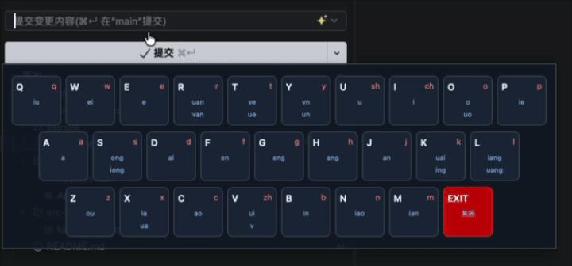

<div align="center">
  
</div>

# 双拼辅助键盘

一款帮助练习小鹤双拼的 macOS 桌面小工具。趁着还有耐心，给自己搓一个会高亮按键的虚拟键盘。

## 项目状态

当前是本地 macOS Alpha 版本，适合边用边改，暂时还没有准备好面向所有人的安装包。

## 功能列表

### 已实现

- [x] 小鹤双拼映射引擎：方案数据驱动，包含声母、韵母、零声母和合法组合规则。
- [x] 虚拟 QWERTY 键盘：展示每个按键对应的双拼信息。
- [x] 全局按键监听：获得 macOS 辅助功能权限后，在其他应用中也能提示当前双拼状态。
- [x] 候选按键高亮：输入首键后，自动筛出可能的第二键。
- [x] 菜单栏常驻：可以检查权限、打开系统设置，以及显示/隐藏悬浮窗口。
- [x] 关闭窗口时驻留托盘：点关闭不会顺手把工具送走。

### 接下来想折腾

这些是已经决定要做、但还没有排进具体版本的优化事项：

- [ ] 样式调整：圆角、透明度，深色浅色主题，都会有的。
- [ ] 设置页面：集中管理窗口外观和行为选项。
- [ ] 快捷键：让常用操作不用每次去点菜单。
- [ ] Windows / Linux 支持：有空再说，先把 macOS 版本搓顺。

## 效果预览

空闲键盘 → 输入首键后的候选高亮 → 输入第二键后复位：



## 环境要求

- macOS（当前主要在近期版本上开发与测试）
- Node.js 20 或更高版本
- Rust stable（含 Cargo）
- macOS 辅助功能权限（系统设置 → 隐私与安全性 → 辅助功能）

## 本地运行

如果你也想在本地试试：

```bash
npm install          # 安装前端依赖
npm test             # 运行全部测试
npm run build        # 构建前端
npm run tauri dev    # 启动桌面开发模式
npm run tauri build  # 打包生产版本
```

工具只读取并可视化按键，不会修改或注入其他应用中的文本。首次使用全局监听时，需要在 macOS 系统设置中授予辅助功能权限。

## 技术栈

- **前端**：React 19、TypeScript、Vite
- **样式**：Tailwind CSS v4
- **桌面外壳**：Tauri 2、Rust
- **测试**：Vitest、Testing Library

## 目录结构

- `src/components/`：React UI 组件
- `src/engine/`：双拼映射与输入状态规则
- `config/`：数据驱动的输入方案
- `src-tauri/`：原生桌面外壳与权限配置
- `docs/`：PRD、ADR、术语表与设计文档（中文）

## 参与开发

这是一个闲暇时间搓出来的小项目，欢迎提 issue、提建议，或者直接提交 PR。功能清单里的“接下来想折腾”会随着实际进度更新，不保证每一项都能准时兑现。

## 许可证

本项目基于 [MIT License](LICENSE) 开源。
